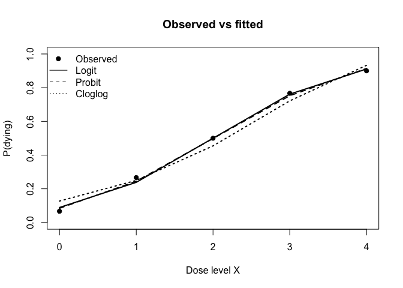
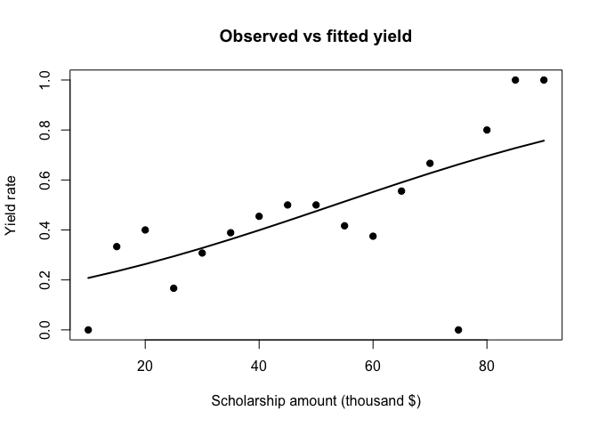

hw2
================
bowen xia
2026-02-12

\#Question1

\##Question 1(a)

``` r
bio <- data.frame(
  x = 0:4,
  dying = c(2, 8, 15, 23, 27)
)
bio$n <- 30
bio$alive <- bio$n - bio$dying
bio
```

    ##   x dying  n alive
    ## 1 0     2 30    28
    ## 2 1     8 30    22
    ## 3 2    15 30    15
    ## 4 3    23 30     7
    ## 5 4    27 30     3

``` r
fit_logit   <- glm(cbind(dying, alive) ~ x, data=bio, family=binomial(link="logit"))
fit_probit  <- glm(cbind(dying, alive) ~ x, data=bio, family=binomial(link="probit"))
fit_cloglog <- glm(cbind(dying, alive) ~ x, data=bio, family=binomial(link="cloglog"))

summary(fit_logit)
```

    ## 
    ## Call:
    ## glm(formula = cbind(dying, alive) ~ x, family = binomial(link = "logit"), 
    ##     data = bio)
    ## 
    ## Coefficients:
    ##             Estimate Std. Error z value Pr(>|z|)    
    ## (Intercept)  -2.3238     0.4179  -5.561 2.69e-08 ***
    ## x             1.1619     0.1814   6.405 1.51e-10 ***
    ## ---
    ## Signif. codes:  0 '***' 0.001 '**' 0.01 '*' 0.05 '.' 0.1 ' ' 1
    ## 
    ## (Dispersion parameter for binomial family taken to be 1)
    ## 
    ##     Null deviance: 64.76327  on 4  degrees of freedom
    ## Residual deviance:  0.37875  on 3  degrees of freedom
    ## AIC: 20.854
    ## 
    ## Number of Fisher Scoring iterations: 4

``` r
summary(fit_probit)
```

    ## 
    ## Call:
    ## glm(formula = cbind(dying, alive) ~ x, family = binomial(link = "probit"), 
    ##     data = bio)
    ## 
    ## Coefficients:
    ##             Estimate Std. Error z value Pr(>|z|)    
    ## (Intercept) -1.37709    0.22781  -6.045 1.49e-09 ***
    ## x            0.68638    0.09677   7.093 1.31e-12 ***
    ## ---
    ## Signif. codes:  0 '***' 0.001 '**' 0.01 '*' 0.05 '.' 0.1 ' ' 1
    ## 
    ## (Dispersion parameter for binomial family taken to be 1)
    ## 
    ##     Null deviance: 64.76327  on 4  degrees of freedom
    ## Residual deviance:  0.31367  on 3  degrees of freedom
    ## AIC: 20.789
    ## 
    ## Number of Fisher Scoring iterations: 4

``` r
summary(fit_cloglog)
```

    ## 
    ## Call:
    ## glm(formula = cbind(dying, alive) ~ x, family = binomial(link = "cloglog"), 
    ##     data = bio)
    ## 
    ## Coefficients:
    ##             Estimate Std. Error z value Pr(>|z|)    
    ## (Intercept)  -1.9942     0.3126  -6.378 1.79e-10 ***
    ## x             0.7468     0.1094   6.824 8.86e-12 ***
    ## ---
    ## Signif. codes:  0 '***' 0.001 '**' 0.01 '*' 0.05 '.' 0.1 ' ' 1
    ## 
    ## (Dispersion parameter for binomial family taken to be 1)
    ## 
    ##     Null deviance: 64.7633  on 4  degrees of freedom
    ## Residual deviance:  2.2305  on 3  degrees of freedom
    ## AIC: 22.706
    ## 
    ## Number of Fisher Scoring iterations: 5

``` r
wald_ci <- function(est, se, level=0.95){
  z <- qnorm(0.5 + level/2)
  c(est - z*se, est + z*se)
}

tab_q1a <- function(fit, model_name){
  b  <- coef(fit)["x"]
  se <- sqrt(vcov(fit)["x","x"])
  ci <- wald_ci(b, se, 0.95)
  dev <- deviance(fit)
  p001 <- predict(fit, newdata=data.frame(x=0.01), type="response")
  data.frame(
    Model = model_name,
    beta_hat = b,
    CI_low = ci[1],
    CI_high = ci[2],
    Deviance = dev,
    p_hat_x_0.01 = as.numeric(p001)
  )
}

q1a_table <- rbind(
  tab_q1a(fit_logit, "logit"),
  tab_q1a(fit_probit, "probit"),
  tab_q1a(fit_cloglog, "c-log-log")
)
q1a_table
```

    ##        Model  beta_hat    CI_low   CI_high  Deviance p_hat_x_0.01
    ## x      logit 1.1618949 0.8063266 1.5174633 0.3787483   0.09011997
    ## x1    probit 0.6863805 0.4967217 0.8760393 0.3136684   0.08530780
    ## x2 c-log-log 0.7468193 0.5323200 0.9613187 2.2304792   0.12816011

\##Comment for question1(a)

``` r
# Residual deviance and df (goodness-of-fit quick check)
data.frame(
  model = c("logit","probit","c-log-log"),
  deviance = c(deviance(fit_logit), deviance(fit_probit), deviance(fit_cloglog)),
  df_resid = c(df.residual(fit_logit), df.residual(fit_probit), df.residual(fit_cloglog)),
  p_value = c(
    1 - pchisq(deviance(fit_logit),  df.residual(fit_logit)),
    1 - pchisq(deviance(fit_probit), df.residual(fit_probit)),
    1 - pchisq(deviance(fit_cloglog),df.residual(fit_cloglog))
  )
)
```

    ##       model  deviance df_resid   p_value
    ## 1     logit 0.3787483        3 0.9445968
    ## 2    probit 0.3136684        3 0.9574377
    ## 3 c-log-log 2.2304792        3 0.5259699

``` r
# Plot fitted probabilities vs observed
bio$obs_p <- bio$dying/bio$n
bio$fit_logit   <- fitted(fit_logit)
bio$fit_probit  <- fitted(fit_probit)
bio$fit_cloglog <- fitted(fit_cloglog)

plot(bio$x, bio$obs_p, pch=19, ylim=c(0,1),
     xlab="Dose level X", ylab="P(dying)", main="Observed vs fitted")
lines(bio$x, bio$fit_logit,   lwd=2)
lines(bio$x, bio$fit_probit,  lwd=2, lty=2)
lines(bio$x, bio$fit_cloglog, lwd=2, lty=3)
legend("topleft", bty="n",
       legend=c("Observed","Logit","Probit","Cloglog"),
       lty=c(NA,1,2,3), pch=c(19,NA,NA,NA))
```

<!-- -->

\##question1(b)

``` r
ld50_delta <- function(fit, link=c("logit","probit","cloglog"), level=0.90){
  link <- match.arg(link)
  a <- coef(fit)["(Intercept)"]
  b <- coef(fit)["x"]
  V <- vcov(fit)[c("(Intercept)","x"), c("(Intercept)","x")]
  
  c0 <- if(link %in% c("logit","probit")) 0 else log(log(2))
  x50 <- (c0 - a)/b
  
  # gradient wrt (a,b)
  da <- -1/b
  db <- -(c0 - a)/(b^2)
  g  <- c(da, db)
  
  se_x50 <- sqrt( t(g) %*% V %*% g )
  z <- qnorm(0.5 + level/2)
  ci_x50 <- c(x50 - z*se_x50, x50 + z*se_x50)
  
  ld50 <- exp(x50)
  ci_ld50 <- exp(ci_x50)
  
  data.frame(
    model = link,
    x50 = as.numeric(x50),
    x50_low = as.numeric(ci_x50[1]),
    x50_high = as.numeric(ci_x50[2]),
    LD50 = as.numeric(ld50),
    LD50_low = as.numeric(ci_ld50[1]),
    LD50_high = as.numeric(ci_ld50[2])
  )
}

q1b <- rbind(
  ld50_delta(fit_logit, "logit", level=0.90),
  ld50_delta(fit_probit, "probit", level=0.90),
  ld50_delta(fit_cloglog, "cloglog", level=0.90)
)
q1b
```

    ##     model      x50  x50_low x50_high     LD50 LD50_low LD50_high
    ## 1   logit 2.000000 1.706498 2.293502 7.389056 5.509631  9.909583
    ## 2  probit 2.006310 1.719653 2.292968 7.435830 5.582588  9.904289
    ## 3 cloglog 2.179428 1.875834 2.483022 8.841249 6.526261 11.977407

\#Question2

``` r
enroll <- data.frame(
  amount = c(10,15,20,25,30,35,40,45,50,55,60,65,70,75,80,85,90),
  offers = c(4,6,10,12,39,36,22,14,10,12,8,9,3,1,5,2,1),
  enrolls= c(0,2,4,2,12,14,10,7,5,5,3,5,2,0,4,2,1)
)
enroll$not_enroll <- enroll$offers - enroll$enrolls
enroll$rate <- enroll$enrolls/enroll$offers
enroll
```

    ##    amount offers enrolls not_enroll      rate
    ## 1      10      4       0          4 0.0000000
    ## 2      15      6       2          4 0.3333333
    ## 3      20     10       4          6 0.4000000
    ## 4      25     12       2         10 0.1666667
    ## 5      30     39      12         27 0.3076923
    ## 6      35     36      14         22 0.3888889
    ## 7      40     22      10         12 0.4545455
    ## 8      45     14       7          7 0.5000000
    ## 9      50     10       5          5 0.5000000
    ## 10     55     12       5          7 0.4166667
    ## 11     60      8       3          5 0.3750000
    ## 12     65      9       5          4 0.5555556
    ## 13     70      3       2          1 0.6666667
    ## 14     75      1       0          1 0.0000000
    ## 15     80      5       4          1 0.8000000
    ## 16     85      2       2          0 1.0000000
    ## 17     90      1       1          0 1.0000000

``` r
fit2 <- glm(cbind(enrolls, not_enroll) ~ amount, data=enroll, family=binomial(link="logit"))
summary(fit2)
```

    ## 
    ## Call:
    ## glm(formula = cbind(enrolls, not_enroll) ~ amount, family = binomial(link = "logit"), 
    ##     data = enroll)
    ## 
    ## Coefficients:
    ##             Estimate Std. Error z value Pr(>|z|)    
    ## (Intercept) -1.64764    0.42144  -3.910 9.25e-05 ***
    ## amount       0.03095    0.00968   3.197  0.00139 ** 
    ## ---
    ## Signif. codes:  0 '***' 0.001 '**' 0.01 '*' 0.05 '.' 0.1 ' ' 1
    ## 
    ## (Dispersion parameter for binomial family taken to be 1)
    ## 
    ##     Null deviance: 21.617  on 16  degrees of freedom
    ## Residual deviance: 10.613  on 15  degrees of freedom
    ## AIC: 51.078
    ## 
    ## Number of Fisher Scoring iterations: 4

\##Question2(a) model fit

``` r
dev <- deviance(fit2)
dfd <- df.residual(fit2)
p_dev <- 1 - pchisq(dev, dfd)

pearson <- sum(residuals(fit2, type="pearson")^2)
p_pear <- 1 - pchisq(pearson, dfd)

data.frame(
  residual_deviance = dev,
  df_resid = dfd,
  p_value_deviance = p_dev,
  pearson_chisq = pearson,
  p_value_pearson = p_pear
)
```

    ##   residual_deviance df_resid p_value_deviance pearson_chisq p_value_pearson
    ## 1          10.61271       15        0.7795345      8.814299       0.8870252

``` r
enroll$fit <- fitted(fit2)
plot(enroll$amount, enroll$rate, pch=19, ylim=c(0,1),
     xlab="Scholarship amount (thousand $)", ylab="Yield rate",
     main="Observed vs fitted yield")
lines(enroll$amount, enroll$fit, lwd=2)
```

<!-- -->

\##Question2(b) Interpret relationship + 95% CI

``` r
amount_for_p <- function(fit, p=0.40, level=0.95){
  a <- coef(fit)["(Intercept)"]
  b <- coef(fit)["amount"]
  V <- vcov(fit)[c("(Intercept)","amount"), c("(Intercept)","amount")]
  
  c0 <- qlogis(p) # logit(p)
  xstar <- (c0 - a)/b
  
  # delta method
  da <- -1/b
  db <- -(c0 - a)/(b^2)
  g <- c(da, db)
  se_x <- sqrt( t(g) %*% V %*% g )
  z <- qnorm(0.5 + level/2)
  ci <- c(xstar - z*se_x, xstar + z*se_x)
  
  data.frame(
    p_target = p,
    amount_hat = as.numeric(xstar),
    amount_low = as.numeric(ci[1]),
    amount_high = as.numeric(ci[2])
  )
}

amount_for_p(fit2, p=0.40, level=0.95)
```

    ##   p_target amount_hat amount_low amount_high
    ## 1      0.4   40.13429   30.58304    49.68553

\##Question2(c)

``` r
amount_for_p <- function(fit, p=0.40, level=0.95){
  a <- coef(fit)["(Intercept)"]
  b <- coef(fit)["amount"]
  V <- vcov(fit)[c("(Intercept)","amount"), c("(Intercept)","amount")]
  
  c0 <- qlogis(p) # logit(p)
  xstar <- (c0 - a)/b
  
  # delta method
  da <- -1/b
  db <- -(c0 - a)/(b^2)
  g <- c(da, db)
  se_x <- sqrt( t(g) %*% V %*% g )
  z <- qnorm(0.5 + level/2)
  ci <- c(xstar - z*se_x, xstar + z*se_x)
  
  data.frame(
    p_target = p,
    amount_hat = as.numeric(xstar),
    amount_low = as.numeric(ci[1]),
    amount_high = as.numeric(ci[2])
  )
}

amount_for_p(fit2, p=0.40, level=0.95)
```

    ##   p_target amount_hat amount_low amount_high
    ## 1      0.4   40.13429   30.58304    49.68553
